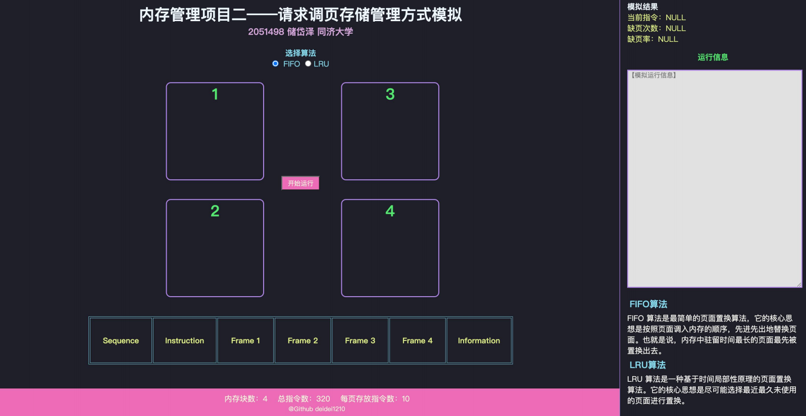
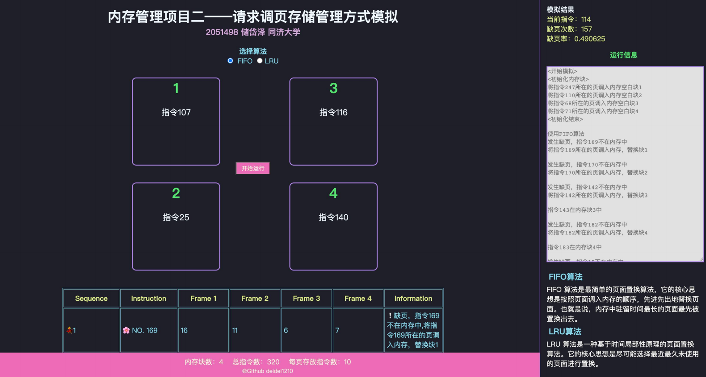
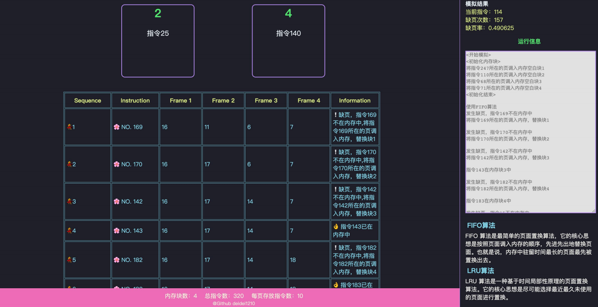

# Memmory-Management-TongjiOS

</img>

呜咪！！！🐱

这是2022-2023春学期同济大学软件学院操作系统文件管理项目仓库🌟

该仓库中是deidei的文件管理项目（借鉴了一些学长学姐的呜呜呜（敏捷开发.jpg））🖊️

能力有限，仅供参考与学习🌸

方便自己之后回过来看也希望对大家有所帮助捏！👀

这是同济大学软件学院操作系统第二次作业，该作业假设每个页面可存放10条指令，分配给一个作业的内存块为4。模拟一个作业的执行过程，该作业有320条指令，即它的地址空间为32页，目前所有页还没有调入内存。在模拟过程中，如果所访问指令在内存中，则显示其物理地址，并转到下一条指令；如果没有在内存中，则发生缺页，此时需要记录缺页次数，并将其调入内存。如果4个内存块中已装入作业，则需进行页面置换。 所有320条指令执行完成后，计算并显示作业执行过程中发生的缺页率。

## 项目目的

通过此次项目的实践，能够学习调页存储管理中页面、页表、地址的转换，
了解页面置换的过程，从而加深对请求调页系统的原理和实现过程的理解。 二、开发环境

- 操作系统平台：MacOS
- 开发软件：VScode , Chrome 浏览器
- 开发语言：Html5 , CSS3 , javascript

## 项目需求

- **基本任务：** 假设每个页面可存放 10 条指令，分配给一个作业的内存块为 4。模拟一个作业的执行过程，该作业有 320 条指令，即它的地址空间为 32 页，目前所有页还没有调入内存。
- **模拟过程：**
在模拟过程中，如果所访问指令在内存中，则显示其物理地址，并转到下一
条指令；如果没有在内存中，则发生缺页，此时需要记录缺页次数，并将其调入
内存。如果 4 个内存块中已装入作业，则需进行页面置换。所有 320 条指令执
行完成后，计算并显示作业执行过程中发生的缺页率。

### 置换算法：

1. 采用先进先出(FIFO)置换算法。
2. 最近最久未使用（LRU）算法

#### FIFO 算法介绍

FIFO 算法，也被称为先进先出算法，是操作系统中用于管理内存中页面置
换的一种算法。这个算法的思想很简单：当页面需要被替换时，选择最早进入内
存的页面进行置换。即，先进入内存的页面先被置换掉，而最近进入内存的页面
则保持在内存中。
具体实现中，操作系统通常维护一个队列，用于按照页表中的顺序记录内存
中的页面。当新的页面进入内存时，它会被添加到队列的末尾。当需要替换页面
时，操作系统选择队列中的第一个页面进行置换。如果该页面被修改，则需要将
其写回磁盘，以确保数据不会丢失。
优点：实现简单、易于理解。
缺点：性能较差，容易产生抖动现象。

#### LRU 算法介绍

LRU 算法，即最近最少使用算法，是用于管理操作系统内存中页面置换的一
种算法。它的基本思想是当页面需要被替换时，将最近最久未被使用的页面替换
出去。
具体实现中，我们可以记录下每个页面上一次被访问的最后时间，以后每执
行一次指令如果发生缺页现象，就将最近访问频率最少，上一次访问时间最早的
那个页面进行替换。
优点：利用了程序局部性原理，性能较好，最接近“最佳算法 OPT”。
缺点：需要额外空间记录每个页面被访问的最后时间，且实现比较复杂。
## 算法实现

### FIFO 算法的实现

首先，系统会先给 4 个内存块初始化，随机装入 4 条指令。如果用户选择了按照 FIFO 算法来进行调页存储管理，则首先系统选择指令的访问次序是“顺序执行”、“向后跳转”还是“向前跳转”。其中，“顺序执行”表示按照指令序号逐个执行，而“向后跳转”和“向前跳转”则表示随机跳转到某个指令。
选择了指令的执行次序之后，系统根据选择的策略，生成接下来要执行的指令。
在执行每个指令时，首先判断该指令是否被执行过。如果没有被执行过，则判断该指令是否在内存中。如果在内存中，则直接执行该指令；反之，如果缺页，则将该指令所在的页调入内存，并替换掉 FIFO 算法中最先进入内存的页。执行完一个指令后，将该指令标记为已执行，并更新界面上显示当前缺页个数和缺页率的标签。

